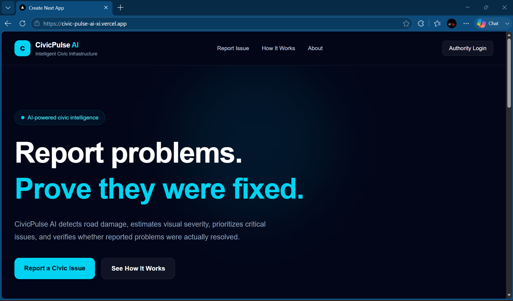
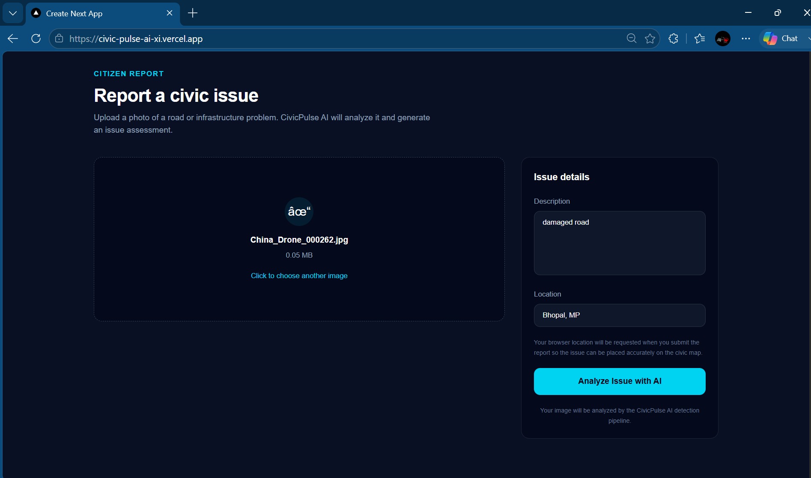
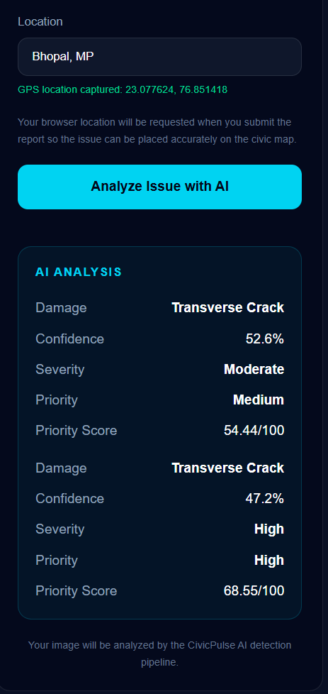
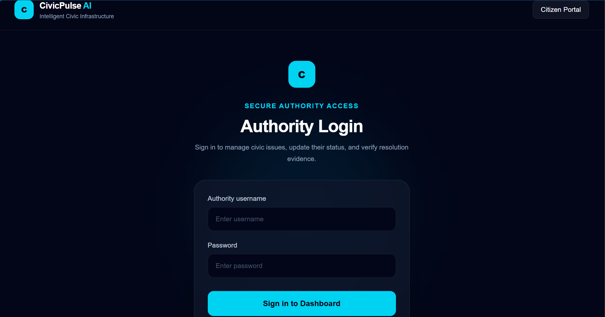
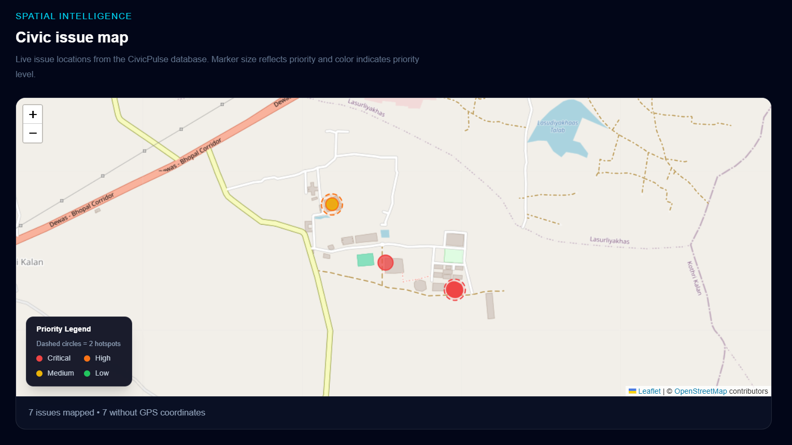
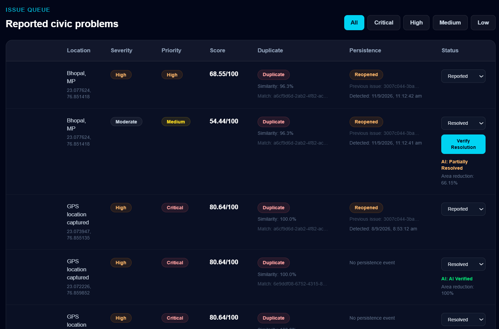

# CivicPulse AI

> **Reporting a civic issue is easy. Proving it was actually fixed is the problem.**

CivicPulse AI is an end-to-end civic infrastructure intelligence platform that uses computer vision and geospatial intelligence to detect road damage, prioritize issues, identify duplicate reports, verify claimed repairs, detect persistent/reopened problems, and surface geographic risk hotspots.

**Live Website:** https://civic-pulse-ai-xi.vercel.app/  
**Backend API:** https://civicpulse-ai-backend-gnkx.onrender.com  
**API Docs:** https://civicpulse-ai-backend-gnkx.onrender.com/docs

---

## Why CivicPulse?

Most civic reporting systems stop after collecting a complaint.

CivicPulse adds an intelligence and accountability layer:

**Report → Detect → Prioritize → Verify Repair → Detect Persistence → Identify Hotspots**

The goal is to help authorities understand not only **what was reported**, but also **what needs attention and whether a claimed repair appears to have worked**.

---

## Core Features

- **AI Road-Damage Detection** — YOLO11n detects four RDD2022 damage classes.
- **Visual Severity Estimation** — estimates Low, Moderate, or High severity using a transparent visual heuristic.
- **Priority Scoring** — converts severity, damage type, affected area, and confidence into a 0–100 priority score.
- **Duplicate / Related Detection** — compares issue images using a lightweight OpenCV + NumPy embedding pipeline.
- **AI-Assisted Resolution Verification** — compares before/after images and estimates detected-area reduction.
- **Persistent / Reopened Issues** — links later similar reports to previously resolved issues.
- **Geographic Risk Hotspots** — groups nearby GPS-enabled issues and highlights high-risk areas.
- **Authority Authentication** — protected authority login and dashboard APIs.
- **Interactive Civic Map** — visualizes reported issues geographically.
- **Cloud Persistence** — Supabase PostgreSQL and Storage keep issue and image data persistent.

---

## Screenshots

### CivicPulse Homepage


### Citizen Issue Reporting


### AI-Powered Analysis


### Authority Login & Dashboard


### Civic Map & Risk Hotspots


### Issue Queue & Resolution


---

## How It Works

```text
Citizen
   │
   ├── Upload image
   ├── Add description
   └── Capture GPS
   │
   ▼
FastAPI Backend
   │
   ▼
YOLO11n Detection
   │
   ├── Damage Type
   ├── Confidence
   └── Affected Area
   │
   ▼
Severity + Priority
   │
   ▼
Image Similarity / Duplicate Detection
   │
   ▼
Supabase PostgreSQL + Storage
   │
   ▼
Authority Dashboard
   │
   ├── Reported
   ├── In Progress
   └── Resolved
          │
          ▼
    Resolution Image
          │
          ▼
   AI Resolution Verification
          │
          ▼
 Persistent / Reopened Detection
          │
          ▼
 Geographic Risk Hotspots
```

---

## System Architecture

```text
┌─────────────────────────────────────┐
│           Next.js Frontend          │
│                                     │
│  Citizen Portal + Authority UI      │
└──────────────────┬──────────────────┘
                   │ REST API
                   ▼
┌─────────────────────────────────────┐
│              FastAPI                │
│                                     │
│ Authentication                      │
│ Issue Analysis                      │
│ Detection                           │
│ Severity                            │
│ Priority                            │
│ Duplicate Detection                 │
│ Resolution Verification             │
│ Persistence Detection               │
└───────────────┬───────────────┬─────┘
                │               │
                ▼               ▼
      ┌────────────────┐  ┌────────────────┐
      │ ML / Computer  │  │    Supabase    │
      │ Vision         │  │                │
      │                │  │ PostgreSQL     │
      │ YOLO11n        │  │ Storage        │
      │ PyTorch        │  │ Issue Data     │
      │ OpenCV         │  │ Embeddings     │
      │ NumPy          │  │ Images         │
      └────────────────┘  └────────────────┘
```

---

## Technology Stack

| Layer | Technologies |
|---|---|
| Frontend | Next.js, React, TypeScript |
| UI | Tailwind CSS, shadcn/ui |
| Charts | Recharts |
| Maps | Leaflet, React Leaflet, OpenStreetMap |
| Backend | Python, FastAPI, Pydantic, Uvicorn |
| Computer Vision | YOLO11n, PyTorch, OpenCV, NumPy |
| Database | Supabase PostgreSQL |
| Storage | Supabase Storage |
| Authentication | Custom signed-token authority authentication |
| Model Training | Kaggle, NVIDIA Tesla T4 |
| Deployment | Vercel, Render |
| Version Control | Git, GitHub |

---

## Machine Learning

**Model:** YOLO11n  
**Dataset:** RDD2022  
**Classes:** Longitudinal Crack, Transverse Crack, Alligator Crack, Pothole  
**Training:** 50 epochs, 640 image size, batch size 16, NVIDIA Tesla T4

### Independent Test Results

| Metric | Result |
|---|---:|
| Precision | **0.627** |
| Recall | **0.590** |
| mAP@50 | **0.611** |
| mAP@50–95 | **0.335** |

### Class-wise Results

| Damage Type | Precision | Recall | mAP@50 | mAP@50–95 |
|---|---:|---:|---:|---:|
| Longitudinal Crack | 0.620 | 0.524 | 0.553 | 0.303 |
| Transverse Crack | 0.554 | 0.519 | 0.521 | 0.257 |
| Alligator Crack | 0.679 | 0.591 | 0.638 | 0.331 |
| Pothole | 0.653 | 0.725 | 0.731 | 0.449 |

Pothole detection is currently the strongest class in the baseline evaluation, while transverse cracking is comparatively more difficult.

---

## Database & Storage

CivicPulse uses **Supabase PostgreSQL** for persistent issue records and **Supabase Storage** for images.

Stored issue information includes:

- Issue ID
- Damage type and confidence
- Affected area
- Severity and priority
- GPS coordinates
- Description and location
- Issue status
- Resolution image and verification result
- Duplicate relationship
- Image embedding
- Persistence relationship
- Reopening information

```text
Frontend
   │
   ▼
FastAPI
   │
   ▼
Supabase PostgreSQL
   ├── Issue metadata
   ├── AI results
   ├── Status
   ├── Duplicate links
   ├── Persistence links
   └── Verification data
          │
          ▼
   Supabase Storage
   ├── Original images
   └── Resolution images
```

---

## Project Structure

```text
CivicPulse-AI/
│
├── backend/
│   ├── main.py
│   ├── auth.py
│   ├── database.py
│   ├── requirements.txt
│   ├── test_detector.py
│   │
│   ├── models/
│   │   └── CivicPulse-YOLO11n-baseline-best.pt
│   │
│   └── services/
│       ├── detector.py
│       ├── duplicate.py
│       ├── priority.py
│       └── severity.py
│
├── frontend/
│   ├── app/
│   │   ├── dashboard/
│   │   ├── login/
│   │   └── page.tsx
│   │
│   └── components/
│
├── data/
├── docs/
│   └── screenshots/
│       ├── 01-homepage.png
│       ├── 02-report-dashboard.png
│       ├── 03-ai-analysis.png
│       ├── 04-authority-dashboard.png
│       ├── 05-civic-map-hotspots.png
│       └── 06-issue-resolution.png
│
├── ml/
├── .gitignore
└── README.md
```

### Important Directories

| Directory | Purpose |
|---|---|
| `backend/` | FastAPI application and backend logic |
| `backend/services/` | Detection, severity, priority, and similarity services |
| `backend/models/` | Trained YOLO model |
| `frontend/` | Next.js citizen and authority interfaces |
| `frontend/app/` | Application routes/pages |
| `frontend/components/` | Reusable UI components |
| `data/` | Local test assets |
| `docs/screenshots/` | README/project screenshots |
| `ml/` | ML/data configuration |

---

## API Overview

### Public

```text
GET  /api/health
POST /api/issues/analyze
```

### Authority Authentication

```text
POST /api/auth/login
GET  /api/auth/me
```

### Protected Authority APIs

```text
GET   /api/issues
PATCH /api/issues/{issue_id}/status
POST  /api/issues/{issue_id}/verify
```

Full interactive API documentation is available through FastAPI Swagger.

---

## Local Setup

### Prerequisites

- Python 3.13 recommended
- Node.js and npm
- Git
- Supabase project
- Required YOLO model file

### Clone

```bash
git clone https://github.com/kishanbishwakarma0/CivicPulse-AI.git
cd CivicPulse-AI
```

### Backend

```cmd
python -m venv .venv
call .venv\Scriptsctivate
cd backend
pip install -r requirements.txt
uvicorn main:app --reload
```

Backend: `http://127.0.0.1:8000`  
Swagger: `http://127.0.0.1:8000/docs`

### Backend Environment Variables

Create a root `.env` file:

```env
SUPABASE_URL=your_supabase_project_url
SUPABASE_SECRET_KEY=your_backend_only_secret_key

AUTHORITY_USERNAME=your_authority_username
AUTHORITY_PASSWORD=your_authority_password
AUTH_TOKEN_SECRET=your_long_random_secret
```

Never commit `.env` or expose backend secrets in the frontend.

### Frontend

Create `frontend/.env.local`:

```env
NEXT_PUBLIC_API_URL=http://127.0.0.1:8000
```

Then:

```cmd
cd frontend
npm install
npm run dev
```

Frontend: `http://localhost:3000`  
Authority Login: `http://localhost:3000/login`  
Authority Dashboard: `http://localhost:3000/dashboard`

---

## Live Deployment

**Frontend:** https://civic-pulse-ai-xi.vercel.app/  
**Backend:** https://civicpulse-ai-backend-gnkx.onrender.com  
**API Docs:** https://civicpulse-ai-backend-gnkx.onrender.com/docs

The deployed prototype has been tested for citizen issue submission, AI analysis, authority authentication, status updates, resolution verification, persistence information, and data persistence after refresh.

---

## Resolution Verification

CivicPulse compares the original issue image with an uploaded resolution image.

```text
Before Image ──┐
               ├── Scene Similarity
After Image ───┘
                     │
                     ▼
              Detection Comparison
                     │
                     ▼
               Area Reduction
                     │
          ┌──────────┼──────────┐
          ▼          ▼          ▼
        ≥70%       ≥30%       <30%
          │          │          │
          ▼          ▼          ▼
     AI Verified  Partially   Not Resolved
                   Resolved
```

The prototype has been tested with an unchanged image and a synthetic repaired image. The synthetic test produced **AI Verified with 100% detected-area reduction**.

This validates pipeline behavior for the constructed test case; it is not a claim of real-world resolution accuracy.

---

## Limitations

- Severity estimation is heuristic, not engineering-grade pavement inspection.
- Priority scoring is a transparent prototype heuristic.
- Duplicate and scene-similarity thresholds require further calibration.
- Resolution verification needs a larger real before/after dataset.
- RDD2022 is focused on road damage and does not cover every civic infrastructure problem.
- GPS accuracy depends on the user's device/browser.
- The system is a technical prototype and does not replace professional infrastructure inspection.

---

## Dataset & Attribution

CivicPulse uses **RDD2022 — The multi-national Road Damage Dataset released through CRDDC 2022** for road-damage detection.

**License:** CC BY-SA 4.0

The dataset is not included in this repository.

- RDD2022 / CRDDC 2022: https://crddc2022.sekilab.global/data/
- RoadDamageDetector: https://github.com/sekilab/RoadDamageDetector
- RDD2022 on Figshare: https://figshare.com/articles/dataset/RDD2022_-_The_multi-national_Road_Damage_Dataset_released_through_CRDDC_2022/21431547

---

## Project Status

**Functional End-to-End Prototype**

- [x] YOLO11n road-damage detection
- [x] Model evaluation
- [x] Visual severity estimation
- [x] Priority scoring
- [x] Duplicate / related issue detection
- [x] Citizen issue submission
- [x] GPS capture
- [x] Authority authentication
- [x] Authority dashboard
- [x] Issue status workflow
- [x] AI-assisted resolution verification
- [x] Persistent / reopened issue detection
- [x] Interactive issue map
- [x] Geographic risk hotspots
- [x] Supabase database and storage
- [x] Production deployment

---

## Author

**Kishan Bishwakarma**

CivicPulse AI — AI-powered civic infrastructure intelligence.
